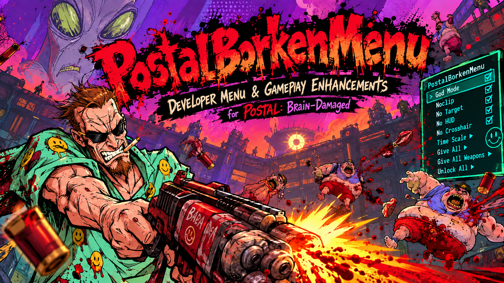
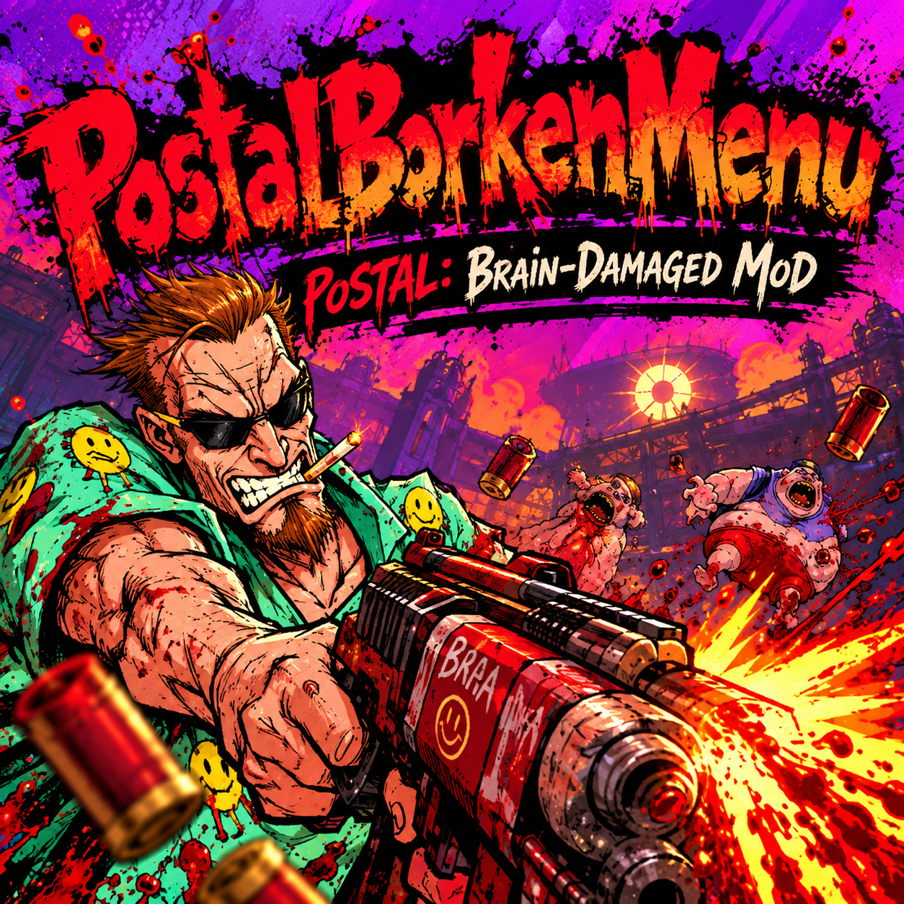

<p align="center">
  
</p>

# PostalBorkenMenu

**PostalBorkenMenu** is an in-game developer menu and gameplay-enhancement project for **POSTAL: Brain-Damaged**.

> **"Borken" is intentional.** It is a nod to *POSTAL: No Regerts*. Please do not autocorrect the project name to "PostalBrokenMenu".

## Current canonical base

**V2A8** is the current validated base.

Validated behavior:

- native developer-command bridge through Unity IL2CPP
- reliable configurable hotkeys
- persistent `PostalBorkenMenu.ini`
- `Give All Weapons` without giving quest items
- `TimeScale` with **0.5x selected by default**
- clicking the same non-1.0 TimeScale value again returns the game to **1.0x**
- visual-only `No Crosshair` without breaking weapon aim
- clean shutdown without the exit crash seen in earlier builds
- no on-disk patching of the game EXE, `GameAssembly.dll`, or `UnityPlayer.dll`

## Important launch rule

**Remove `-debug` from POSTAL: Brain-Damaged launch options before using PostalBorkenMenu.**

PostalBorkenMenu calls the game's native developer systems directly and does not require the game's own debug startup mode.

## Artwork

<p align="center">
  
</p>

## Installation

PostalBorkenMenu is an **x64 ASI** and requires a compatible ASI loader.

The distributed PostalBorkenMenu update package contains exactly:

```text
PostalBorkenMenu.asi
PostalBorkenMenu.ini
PostalBorkenMenu.log
README.txt
```

The ASI loader is intentionally kept separate from update packages.

## Default controls

```text
F1  Open / close PostalBorkenMenu
F2  God Mode
F3  Noclip
F4  No Target
F5  No HUD
F6  Give All
F7  Unlock All
```

`No Crosshair`, `Give All Weapons`, and other entries can be run from the menu and assigned their own keys.

## Developer commands currently exposed

PostalBorkenMenu resolves and uses the game's native developer-command system where available:

```text
Help
NextLevel
NoNpc
ForceAggro
GodMode
Noclip
NoTarget
NoHud
NoHudWithCrossHair
NoModel
TimeScale
LogTime
GiveAll
UnlockAll
NoMenu
KillPresident
```

PostalBorkenMenu also adds separate synthetic entries such as:

```text
No Crosshair
Give All Weapons
```

Native rows are preserved. Synthetic features are added as separate commands rather than replacing vanilla developer commands.

## Architecture

POSTAL: Brain-Damaged is an **x64 Unity IL2CPP** game. The audited build used during development identifies as Unity **2021.3.14f1**.

PostalBorkenMenu dynamically resolves IL2CPP exports and metadata names at runtime. The mod follows a temporary attach/detach policy for IL2CPP work and avoids keeping permanent GC handles for command objects.

The V2A8 shutdown model fences IL2CPP work early during game shutdown and removes the permanent crosshair polling loop that caused an exit-race regression in V2A7.

## V2A8 frozen behavior

The following rules are considered stable unless a later test explicitly proves otherwise:

1. Keep the intentional `PostalBorkenMenu` spelling.
2. Remove `-debug` before testing.
3. Preserve the temporary IL2CPP attach/detach lifetime model.
4. Preserve parameter/keybind persistence.
5. Preserve native developer-command rows.
6. `Give All Weapons` remains a separate command and must not give quest items.
7. `No Crosshair` must be visual-only and must never use `SetCurrentCrosshair(NULL)`.
8. TimeScale defaults to 0.5x; second click on the same non-1 value returns to 1.0x.
9. Avoid permanent 250 ms IL2CPP polling for crosshair refresh.
10. Future work starts from V2A8.

## Audited game-file hashes

```text
POSTAL Brain Damaged.exe
SHA-256 bdad7435995324cf35ca843bd0809dc28c600e283ca76b68b77e28dce0ac40f0

UnityPlayer.dll
SHA-256 27b88589c217589675c976bd303984286bb4b71516ab68efac1c178401a31e94

GameAssembly.dll
SHA-256 4281f23fc35afc17c6fe591b3dc06a4e29ba64ef0b1259de0ac8589c47e9c284

baselib.dll
SHA-256 78fd9445a545727bfcad40ed13f0593b83d608a5ed83be5f2a7ea3a67045bc07

global-metadata.dat
SHA-256 30537a062d887bb3bda9e0e48414f560d2f41d2a574073e9e34c2efb7cad5b98

PostalBorkenMenu.asi V2A8
SHA-256 0ca3f8d01257b84daca0d55b9ea9fe6cea6c0f6d16ef080a83815ae33ad0706a
```

## Project history

Development progressed through:

- **V1A**: WinHTTP proxy proof of concept
- **V1B**: D3D12 loader experiment
- **V1C**: D3D11 validation
- **V2A / V2A1**: ASI migration and first shutdown investigation
- **V2A2**: IL2CPP lifetime fix, first stable clean exit
- **V2A3**: persistence and direct TimeScale work
- **V2A4**: expanded 18-row command table; `Give All Weapons` validated
- **V2A5**: rejected logical crosshair-null method because it altered weapon aim
- **V2A6**: reliable hotkey polling and TimeScale toggle validation
- **V2A7**: CanvasRenderer visual crosshair method validated in-game, but exit regression remained
- **V2A8**: early shutdown fencing + event-driven crosshair refresh; current canonical base

The detailed engineering notebook is kept under `docs/`.

## Next major feature

Once the developer-menu foundation is frozen, the next planned branch is support for using **owned These Sunny Daze DLC weapons in the base campaign**, while preserving normal DLC ownership checks.

## Disclaimer

This is an unofficial fan project and is not affiliated with Running With Scissors, Hyperstrange, CreativeForge Games, or the game's publishers.

The project is intended for legitimate modding of a user's own game installation.
