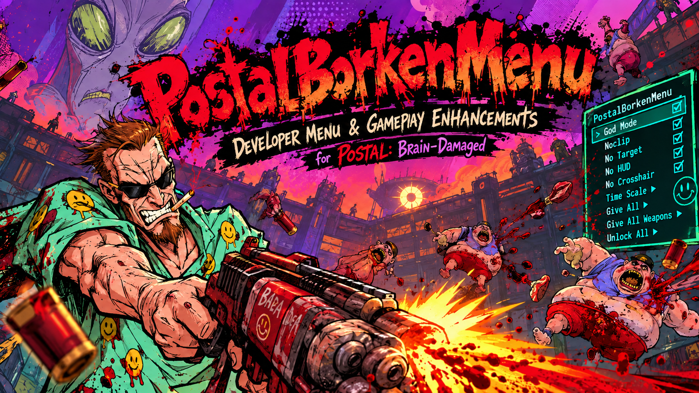
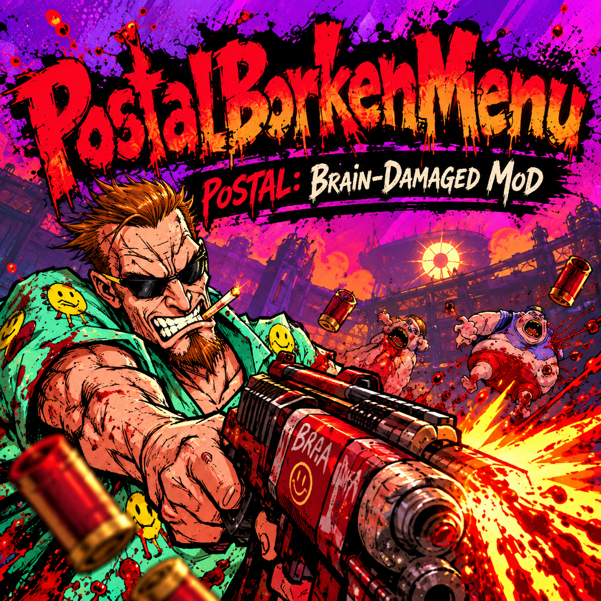

<p align="center">
  
</p>

# PostalBorkenMenu

**PostalBorkenMenu** is an in-game developer menu and gameplay-enhancement project for **POSTAL: Brain-Damaged**.

> **"Borken" is intentional.** It is a nod to *POSTAL: No Regerts*. Please do not autocorrect the project name to "PostalBrokenMenu".

## Current project state

**V2A42-H43** remains the current stable public release.

**V2A42-H59** is the current user-validated development checkpoint for the DLC/Base weapon-wheel work.

It preserves the validated H13 gameplay/stability foundation and adds the now-validated native Unity startup-logo skip.

Validated H43 behavior:

- five-tab in-game menu
- reliable configurable hotkeys and persistent INI
- validated Grappling Hook path using exact `WEAPON_Hook` -> `AddWeapon` when required -> `WeaponsInventory.InitHook()`
- Base Weapon Wheel preserved on the validated H4/H13 path
- visual-only `No Crosshair` across base-game and DLC crosshair controllers
- Give All Weapons / named Arsenal and Special entries
- TimeScale toggle behavior
- native Unity startup-logo skip through the real `UnityPlayer.dll` `CancelSplashScreen()` path
- persistent **Skip Startup Logos** menu toggle, applied on the next launch
- redundant **Skip Intro Videos** mod option removed because the game already provides its own setting
- Help and Log Time hidden from the overlay while their internal command records remain in place to preserve stable indices
- V2A8 early shutdown fencing
- one-launch-one-log diagnostics
- x64 `dxgi.dll` proxy/ASI loader included in the current package
- no on-disk patching of the game EXE, `GameAssembly.dll`, `UnityPlayer.dll`, or Unity asset files

Current package contents:

```text
dxgi.dll
PostalBorkenMenu.asi
PostalBorkenMenu.ini
README.txt
```

### DLC / Base weapon-wheel status

H59 validates the logical weapon pairing for both 9-sector wheels.

The five mode-specific weapon pairs are now matched strictly by native `WeaponId.get_Slot()` values:

- slot 1: base melee ↔ DLC drill
- slot 2: base pistol ↔ DLC piss gun
- slot 3: base shotgun ↔ DLC meat shotgun
- slot 4: base machine gun ↔ DLC bubble-gum machine gun
- slot 8: base DildoBow ↔ DLC NuclearSyringe

Common slots 5, 6, 7 and 9 are left native and are never remapped.

Validated H59 result:
- normal wheel in normal mode: logically correct
- DLC wheel in DLC mode: logically correct
- both wheels populate all 9 sectors

Known remaining cross-mode limitation:
- requesting the DLC wheel while playing normal mode still displays the normal-mode wheel presentation
- requesting the normal wheel while playing DLC still displays the DLC-mode wheel presentation

The next wheel work must therefore focus on cross-mode wheel identity/presentation, not on reworking the now-validated logical slot pairing.

### Open work

- fix cross-mode wheel identity/presentation while preserving H59 slot pairing
- correct cross-mode icons only after wheel identity is resolved
- H9-H12 wheel experiments remain rejected and must not be reused as a base
- the game's own **Skip Intro Videos** setting is left to the game; PostalBorkenMenu no longer duplicates it.

### Download

**Latest stable release: V2A42-H43**

The GitHub Release contains exactly:

```text
dxgi.dll
PostalBorkenMenu.asi
PostalBorkenMenu.ini
README.txt
```

The older H13 and V2A8 releases remain available as historical packaging.

## Important launch rule

**Remove `-debug` from POSTAL: Brain-Damaged launch options before using PostalBorkenMenu.**

PostalBorkenMenu calls the game's native developer systems directly and does not require the game's own debug startup mode.

## Artwork

<p align="center">
  
</p>

## Installation

PostalBorkenMenu is an **x64 ASI** and requires a compatible ASI loader.

The current V2A42-H43 release ZIP contains exactly:

```text
dxgi.dll
PostalBorkenMenu.asi
PostalBorkenMenu.ini
README.txt
```

`PostalBorkenMenu.log` is generated by the mod at runtime and is not pre-packaged.

The included `dxgi.dll` is the project's minimal x64 DXGI proxy/ASI loader.

## Default controls

```text
F1  Open / close PostalBorkenMenu
F2  God Mode
F3  Noclip
F4  No Target
F5  No HUD
F6  Give All
F7  Unlock All
```

`No Crosshair`, `Give All Weapons`, and other entries can be run from the menu and assigned their own keys.

## Developer commands currently exposed

PostalBorkenMenu resolves and uses the game's native developer-command system where available.

Visible native rows include:

```text
NextLevel
NoNpc
ForceAggro
GodMode
Noclip
NoTarget
NoHud
NoHudWithCrossHair
NoModel
TimeScale
GiveAll
UnlockAll
NoMenu
KillPresident
```

`Help` and `LogTime` remain in the internal command table for index stability but are hidden from the overlay.

PostalBorkenMenu also adds separate synthetic entries such as:

```text
No Crosshair
Give All Weapons
```

Native rows are preserved. Synthetic features are added as separate commands rather than replacing vanilla developer commands.

## Architecture

POSTAL: Brain-Damaged is an **x64 Unity IL2CPP** game. The audited build used during development identifies as Unity **2021.3.14f1**.

PostalBorkenMenu dynamically resolves IL2CPP exports and metadata names at runtime. The mod follows a temporary attach/detach policy for IL2CPP work and avoids keeping permanent GC handles for command objects.

The V2A8 shutdown model fences IL2CPP work early during game shutdown and removes the permanent crosshair polling loop that caused an exit-race regression in V2A7.

## Stable behavior inherited from V2A8

The following rules are considered stable unless a later test explicitly proves otherwise:

1. Keep the intentional `PostalBorkenMenu` spelling.
2. Remove `-debug` before testing.
3. Preserve the temporary IL2CPP attach/detach lifetime model.
4. Preserve parameter/keybind persistence.
5. Preserve native developer-command rows.
6. `Give All Weapons` remains a separate command and must not give quest items.
7. `No Crosshair` must be visual-only and must never use `SetCurrentCrosshair(NULL)`.
8. TimeScale defaults to 0.5x; second click on the same non-1 value returns to 1.0x.
9. Avoid permanent 250 ms IL2CPP polling for crosshair refresh.
10. V2A8 lifetime/shutdown rules remain frozen; current feature work starts from validated V2A42-H13.

## Audited game-file hashes

```text
POSTAL Brain Damaged.exe
SHA-256 bdad7435995324cf35ca843bd0809dc28c600e283ca76b68b77e28dce0ac40f0

UnityPlayer.dll
SHA-256 27b88589c217589675c976bd303984286bb4b71516ab68efac1c178401a31e94

GameAssembly.dll
SHA-256 4281f23fc35afc17c6fe591b3dc06a4e29ba64ef0b1259de0ac8589c47e9c284

baselib.dll
SHA-256 78fd9445a545727bfcad40ed13f0593b83d608a5ed83be5f2a7ea3a67045bc07

global-metadata.dat
SHA-256 30537a062d887bb3bda9e0e48414f560d2f41d2a574073e9e34c2efb7cad5b98

PostalBorkenMenu.asi V2A8
SHA-256 0ca3f8d01257b84daca0d55b9ea9fe6cea6c0f6d16ef080a83815ae33ad0706a
```

## Project history

Development progressed through:

- **V1A**: WinHTTP proxy proof of concept
- **V1B**: D3D12 loader experiment
- **V1C**: D3D11 validation
- **V2A / V2A1**: ASI migration and first shutdown investigation
- **V2A2**: IL2CPP lifetime fix, first stable clean exit
- **V2A3**: persistence and direct TimeScale work
- **V2A4**: expanded 18-row command table; `Give All Weapons` validated
- **V2A5**: rejected logical crosshair-null method because it altered weapon aim
- **V2A6**: reliable hotkey polling and TimeScale toggle validation
- **V2A7**: CanvasRenderer visual crosshair method validated in-game, but exit regression remained
- **V2A8**: early shutdown fencing + event-driven crosshair refresh; stable lifetime foundation
- **V2A42-H3/H4**: validated Grappling Hook path and menu cleanup
- **V2A42-H13**: validated recovery base; Base Weapon Wheel restored and No Crosshair extended across DLC crosshair controllers
- **V2A42-H39**: validated native Unity startup-logo skip using the real `CancelSplashScreen()` path
- **V2A42-H40**: added persistent Skip Startup Logos menu toggle
- **V2A42-H43**: safe menu cleanup; Help, Log Time and redundant Skip Intro Videos hidden without shifting internal command indices; current stable public release
- **V2A42-H57**: first validated 9/9 population in both wheel contexts using bidirectional temporary remapping
- **V2A42-H59**: validated logical wheel pairing by native slots 1,2,3,4,8; fixes melee/pistol inversion, duplicate CatCanon remap, missing slot-4 machine gun, and shifted shotgun mapping; current development checkpoint

The detailed engineering notebook is kept under `docs/`.

## Next major feature

The next planned branch is the **DLC Weapon Wheel**: making owned *These Sunny Daze* DLC weapons usable through a proper wheel path without regressing the validated base weapon wheel.

## Disclaimer

This is an unofficial fan project and is not affiliated with Running With Scissors, Hyperstrange, CreativeForge Games, or the game's publishers.

The project is intended for legitimate modding of a user's own game installation.
